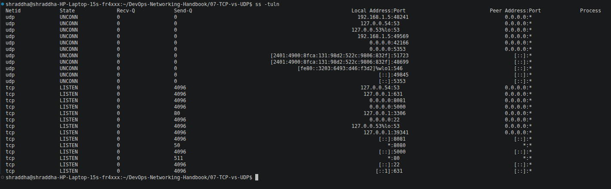
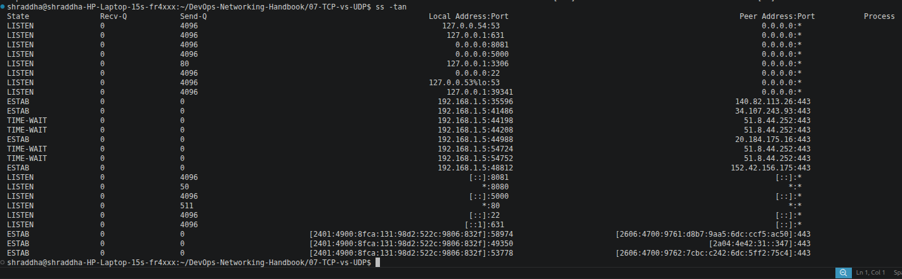
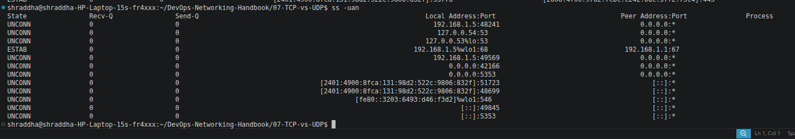
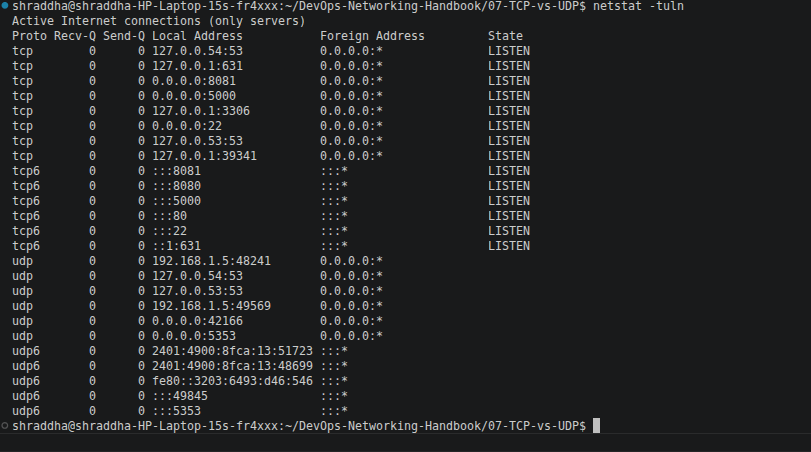
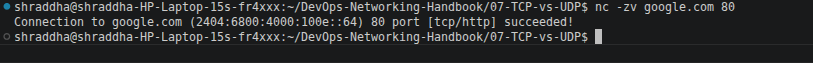
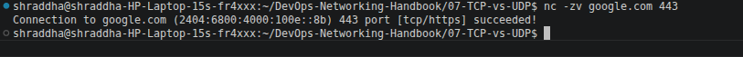
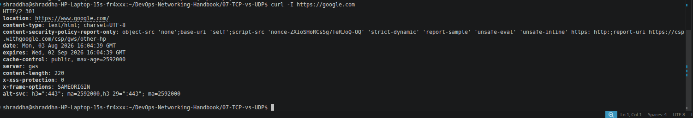

# 💻 TCP vs UDP Commands

This document contains commonly used Linux commands to inspect, monitor, and troubleshoot TCP and UDP connections. These commands are frequently used by Linux Administrators, Network Engineers, DevOps Engineers, and Site Reliability Engineers (SREs).

---

# 📑 Table of Contents

1. View Listening TCP and UDP Ports
2. View All TCP Connections
3. View All UDP Connections
4. View Listening Ports Using netstat
5. Test TCP Port 80
6. Test TCP Port 443
7. Retrieve HTTP Response Headers
8. Command Summary
9. DevOps Use Cases

---

# 1️⃣ View Listening TCP and UDP Ports

## Command

```bash
ss -tuln
```

### Description

Displays all listening TCP and UDP ports without resolving service names.

### Example Output

```text
Netid State  Recv-Q Send-Q Local Address:Port
tcp   LISTEN 0      128    0.0.0.0:22
tcp   LISTEN 0      511    0.0.0.0:80
udp   UNCONN 0      0      127.0.0.53:53
```

### Screenshot



---

# 2️⃣ View All TCP Connections

## Command

```bash
ss -tan
```

### Description

Displays all TCP sockets, including listening and established connections.

### Screenshot



---

# 3️⃣ View All UDP Connections

## Command

```bash
ss -uan
```

### Description

Displays all active UDP sockets.

### Screenshot



---

# 4️⃣ View Listening Ports Using netstat

## Command

```bash
netstat -tuln
```

### Description

Shows listening TCP and UDP ports using the legacy `netstat` utility.

### Screenshot



---

# 5️⃣ Test HTTP Port (80)

## Command

```bash
nc -zv google.com 80
```

### Description

Tests whether TCP port **80 (HTTP)** is open and reachable.

### Expected Output

```text
Connection to google.com 80 port [tcp/http] succeeded!
```

### Screenshot



---

# 6️⃣ Test HTTPS Port (443)

## Command

```bash
nc -zv google.com 443
```

### Description

Tests whether TCP port **443 (HTTPS)** is open.

### Expected Output

```text
Connection to google.com 443 port [tcp/https] succeeded!
```

### Screenshot



---

# 7️⃣ Retrieve HTTP Response Headers

## Command

```bash
curl -I https://google.com
```

### Description

Retrieves only the HTTP response headers from a website without downloading the full page.

### Example Output

```text
HTTP/2 200
content-type: text/html
server: gws
```

### Screenshot



---

# 📋 Command Summary

| Command | Purpose |
|---------|---------|
| `ss -tuln` | Show listening TCP and UDP ports |
| `ss -tan` | Display all TCP connections |
| `ss -uan` | Display all UDP sockets |
| `netstat -tuln` | Show listening ports using netstat |
| `nc -zv google.com 80` | Test HTTP connectivity |
| `nc -zv google.com 443` | Test HTTPS connectivity |
| `curl -I https://google.com` | Retrieve HTTP response headers |

---

# ☁️ DevOps Use Cases

These commands are commonly used to:

- Verify whether an application is listening on the correct port.
- Check if a service is running.
- Troubleshoot SSH connectivity.
- Verify Docker container port mappings.
- Inspect Kubernetes Service ports.
- Test HTTP and HTTPS connectivity.
- Validate firewall rules.
- Confirm network accessibility between servers.

---

# 📝 Summary

Understanding these commands is essential for diagnosing network issues in Linux environments. They help verify open ports, inspect active TCP and UDP connections, test remote services, and troubleshoot connectivity problems in cloud, DevOps, and production systems.
