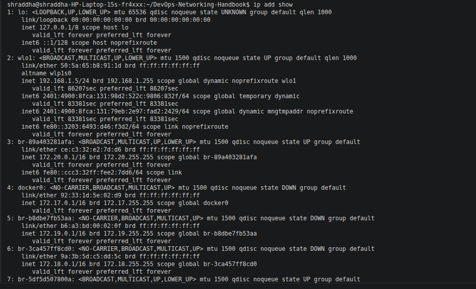

# 💻 IP Addressing Commands

This document contains commonly used Linux commands to inspect, configure, and troubleshoot IP addressing. These commands are frequently used by Linux Administrators, Network Engineers, DevOps Engineers, Cloud Engineers, and Site Reliability Engineers (SREs).

---

# 📑 Table of Contents

1. Display IP Addresses
2. Display IP Address Only
3. Display Routing Table
4. Display Public IP Address
5. Test Connectivity Using IP Address
6. Test Connectivity Using Domain Name
7. Calculate Network Information
8. Command Summary
9. DevOps Use Cases

---

# 1️⃣ Display IP Addresses

## Command

```bash
ip addr show
```

### Description

Displays all network interfaces along with their IPv4 and IPv6 addresses.

### Screenshot



---

# 2️⃣ Display IP Address Only

## Command

```bash
hostname -I
```

### Description

Displays the IP address(es) assigned to the current machine.

### Screenshot


---

# 3️⃣ Display Routing Table

## Command

```bash
ip route
```

### Description

Displays the system's routing table, including the default gateway and network routes.

### Screenshot


---

# 4️⃣ Display Public IP Address

## Command

```bash
curl ifconfig.me
```

### Description

Displays the public IP address assigned by your Internet Service Provider (ISP).

### Screenshot


---

# 5️⃣ Test Connectivity Using an IP Address

## Command

```bash
ping 8.8.8.8
```

### Description

Tests connectivity to Google's public DNS server using its IP address.

### Screenshot


---

# 6️⃣ Test Connectivity Using a Domain Name

## Command

```bash
ping google.com
```

### Description

Tests connectivity and verifies DNS name resolution.

### Screenshot


---

# 7️⃣ Calculate Network Information

## Command

```bash
ipcalc 192.168.1.10/24
```

### Description

Displays subnet mask, network ID, broadcast address, and usable host range.

### Example Output

```text
Address:   192.168.1.10
Network:   192.168.1.0/24
Broadcast: 192.168.1.255
Hosts/Net: 254
```

### Screenshot


---

# 📋 Command Summary

| Command | Purpose |
|---------|---------|
| `ip addr show` | Show network interfaces and IP addresses |
| `hostname -I` | Display local IP address |
| `ip route` | Display routing table |
| `curl ifconfig.me` | Display public IP address |
| `ping 8.8.8.8` | Test network connectivity |
| `ping google.com` | Test DNS resolution |
| `ipcalc 192.168.1.10/24` | Calculate subnet details |

---

# ☁️ DevOps Use Cases

These commands are commonly used to:

- Verify server IP configuration.
- Check routing information.
- Identify public and private IP addresses.
- Test network and Internet connectivity.
- Verify DNS resolution.
- Plan subnetting using CIDR notation.
- Troubleshoot cloud networking issues in AWS, Azure, and GCP.
- Validate Docker and Kubernetes network configurations.

---

# 📝 Summary

Linux networking commands provide essential information about IP configuration, routing, connectivity, and subnetting. Mastering these commands helps troubleshoot servers, cloud infrastructure, containers, and enterprise networks efficiently.
