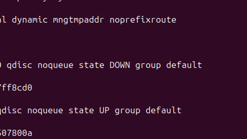
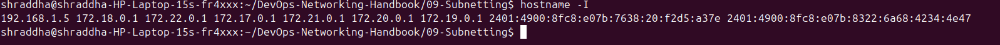
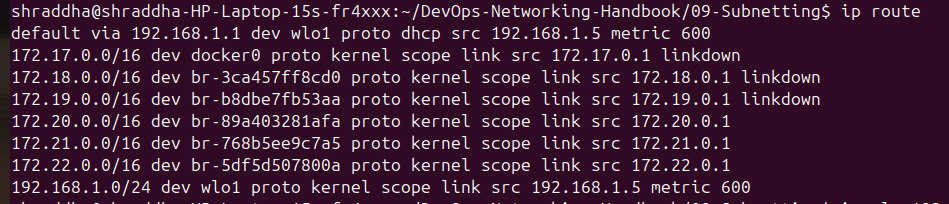
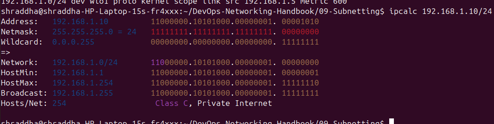
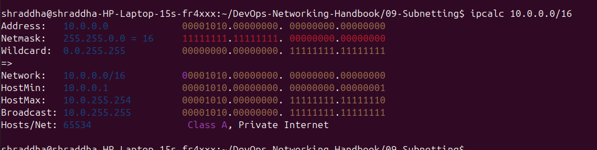
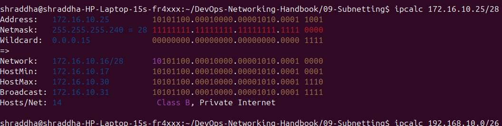
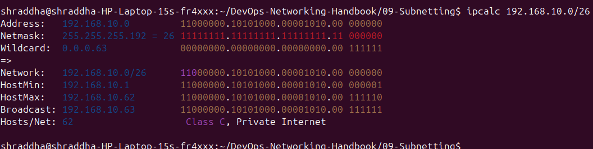

# 💻 Subnetting Commands

This document contains commonly used Linux commands for understanding and verifying subnetting, IP addresses, routing information, and network calculations. These commands are useful for Linux Administrators, Network Engineers, DevOps Engineers, Cloud Engineers, and Site Reliability Engineers (SREs).

---

# 📑 Table of Contents

1. Display IP Addresses
2. Display Local IP Address
3. Display Routing Table
4. Calculate a /24 Network
5. Calculate a /16 Network
6. Calculate a /28 Network
7. Calculate a /26 Network
8. Command Summary
9. DevOps Use Cases

---

# 1️⃣ Display IP Addresses

## Command

```bash
ip addr show
```

### Description

Displays all network interfaces along with their IPv4 and IPv6 addresses.

### Screenshot



---

# 2️⃣ Display Local IP Address

## Command

```bash
hostname -I
```

### Description

Displays the IP address(es) assigned to the current machine.

### Screenshot



---

# 3️⃣ Display Routing Table

## Command

```bash
ip route
```

### Description

Displays the routing table, including the default gateway and network routes.

### Screenshot



---

# 4️⃣ Calculate a /24 Network

## Command

```bash
ipcalc 192.168.1.10/24
```

### Description

Calculates the subnet information for a /24 network.

### Example Output

```text
Network:   192.168.1.0/24
Broadcast: 192.168.1.255
Hosts/Net: 254
```

### Screenshot



---

# 5️⃣ Calculate a /16 Network

## Command

```bash
ipcalc 10.0.0.0/16
```

### Description

Calculates subnet details for a /16 network.

### Screenshot



---

# 6️⃣ Calculate a /28 Network

## Command

```bash
ipcalc 172.16.10.25/28
```

### Description

Calculates the network address, broadcast address, and usable host range for a /28 subnet.

### Screenshot



---

# 7️⃣ Calculate a /26 Network

## Command

```bash
ipcalc 192.168.10.0/26
```

### Description

Displays subnet information for a /26 network.

### Screenshot



---

# 📋 Command Summary

| Command | Purpose |
|---------|---------|
| `ip addr show` | Display IP addresses |
| `hostname -I` | Display local IP |
| `ip route` | Display routing table |
| `ipcalc 192.168.1.10/24` | Calculate /24 subnet |
| `ipcalc 10.0.0.0/16` | Calculate /16 subnet |
| `ipcalc 172.16.10.25/28` | Calculate /28 subnet |
| `ipcalc 192.168.10.0/26` | Calculate /26 subnet |

---

# ☁️ DevOps Use Cases

Subnetting commands are commonly used to:

- Design AWS VPC subnets.
- Plan Kubernetes cluster networking.
- Configure Docker bridge networks.
- Verify network configurations.
- Calculate subnet ranges.
- Troubleshoot routing and IP allocation.
- Design scalable cloud infrastructures.

---

# 📝 Summary

Subnetting commands help engineers calculate network information, verify IP configurations, and design efficient networks. Tools like `ipcalc`, `ip addr`, and `ip route` are essential for Linux, networking, cloud, and DevOps environments.
