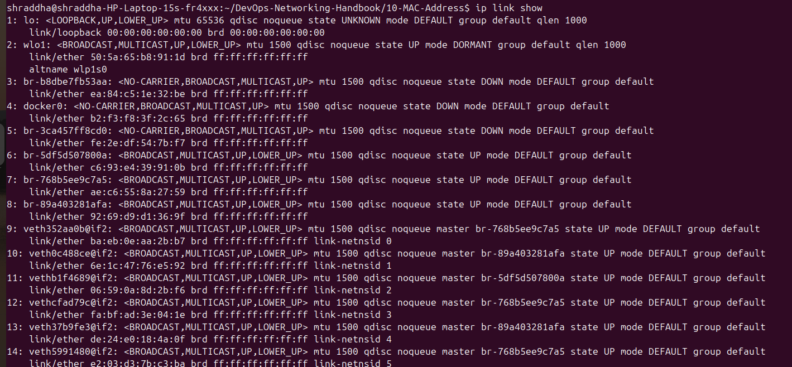
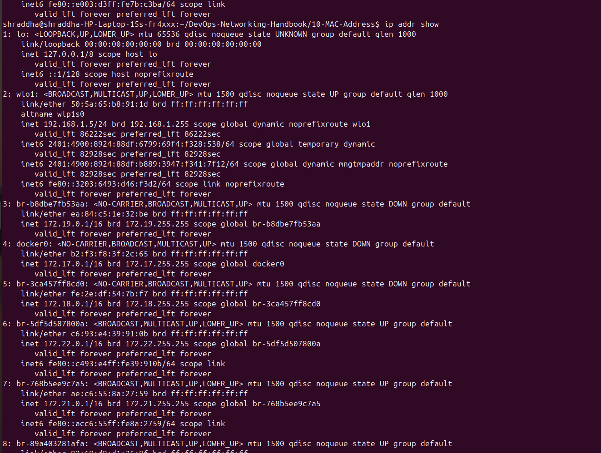
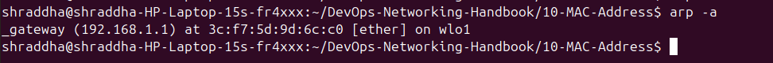
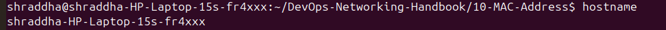
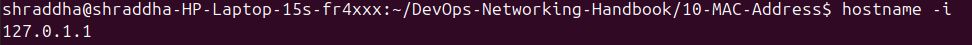
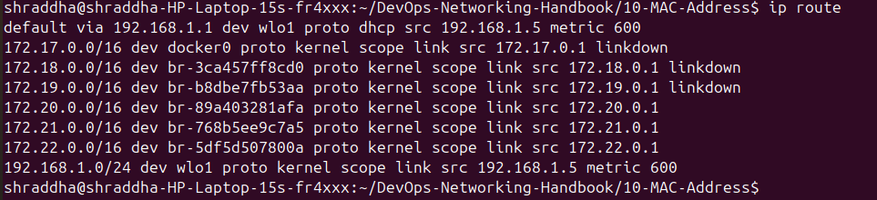

# 💻 MAC Address Commands

This document contains commonly used Linux commands to view MAC addresses, network interfaces, neighbor tables, ARP cache, host information, and routing details. These commands are essential for Linux Administrators, Network Engineers, Cloud Engineers, DevOps Engineers, and Site Reliability Engineers (SREs).

---

# 📑 Table of Contents

1. Display Network Interfaces
2. Display IP and MAC Addresses
3. Display Neighbor Table
4. Display ARP Cache
5. Display Hostname
6. Display Local IP Address
7. Display Routing Table
8. Command Summary
9. DevOps Use Cases

---

# 1️⃣ Display Network Interfaces

## Command

```bash
ip link show
```

### Description

Displays all network interfaces along with their MAC (link-layer) addresses and interface status.

### Screenshot



---

# 2️⃣ Display IP and MAC Addresses

## Command

```bash
ip addr show
```

### Description

Displays all network interfaces with their IPv4, IPv6, and MAC addresses.

### Screenshot



---

# 3️⃣ Display Neighbor Table

## Command

```bash
ip neigh
```

### Description

Displays the ARP/Neighbor table, showing the mapping between IP addresses and MAC addresses.

### Screenshot


---

# 4️⃣ Display ARP Cache

## Command

```bash
arp -a
```

### Description

Displays the ARP cache, which stores recently resolved IP-to-MAC address mappings.

### Example Output

```text
_gateway (192.168.1.1) at 3c:f7:5d:9d:6c:c0 [ether] on wlo1
```

### Screenshot



---

# 5️⃣ Display Hostname

## Command

```bash
hostname
```

### Description

Displays the hostname of the current Linux system.

### Screenshot



---

# 6️⃣ Display Local IP Address

## Command

```bash
hostname -I
```

### Description

Displays the local IP address assigned to the system.

### Screenshot



---

# 7️⃣ Display Routing Table

## Command

```bash
ip route
```

### Description

Displays the system routing table, including the default gateway and network routes.

### Screenshot



---

# 📋 Command Summary

| Command | Purpose |
|---------|---------|
| `ip link show` | Display network interfaces and MAC addresses |
| `ip addr show` | Display IP and MAC addresses |
| `ip neigh` | Display neighbor (ARP) table |
| `arp -a` | Display ARP cache |
| `hostname` | Display system hostname |
| `hostname -I` | Display local IP address |
| `ip route` | Display routing table |

---

# ☁️ DevOps Use Cases

These commands are commonly used to:

- Verify MAC addresses on Linux servers.
- Troubleshoot Layer 2 connectivity.
- Check ARP resolution issues.
- Verify IP-to-MAC mappings.
- Troubleshoot Docker and Kubernetes networking.
- Validate routing configuration.
- Diagnose network communication problems.

---

# 📝 Summary

Linux provides several commands to inspect MAC addresses, network interfaces, routing information, and ARP mappings. Mastering these commands is essential for networking, cloud computing, Linux administration, and DevOps troubleshooting.
