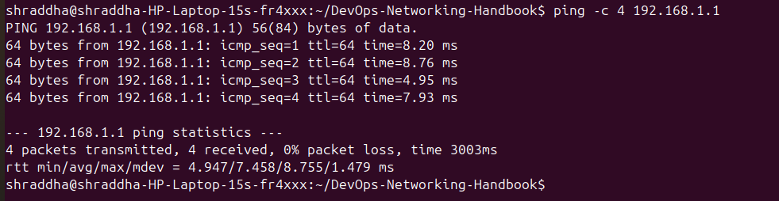
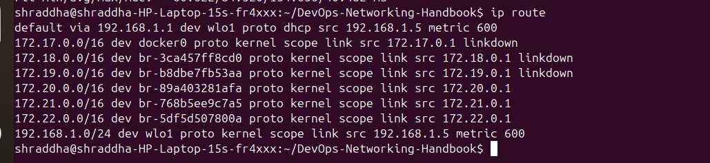

# 💻 ARP Commands

This document covers the most commonly used Linux commands for viewing and troubleshooting ARP (Address Resolution Protocol), neighbor tables, IP addresses, network interfaces, connectivity, and routing.

These commands are frequently used by Linux Administrators, Network Engineers, Cloud Engineers, DevOps Engineers, and Site Reliability Engineers (SREs).

---

# 📑 Table of Contents

1. Display ARP Cache
2. Display Neighbor Table
3. Display IP Address Information
4. Display Network Interfaces
5. Test Connectivity to Gateway
6. Test Internet Connectivity
7. Display Routing Table
8. Command Summary
9. DevOps Use Cases

---

# 1️⃣ Display ARP Cache

## Command

```bash
arp -a
```

### Description

Displays the ARP cache, which stores IP-to-MAC address mappings learned by the system.

### Example Output

```text
_gateway (192.168.1.1) at 3c:f7:5d:9d:6c:c0 [ether] on wlo1
```

### Screenshot


---

# 2️⃣ Display Neighbor Table

## Command

```bash
ip neigh
```

### Description

Displays the Linux neighbor table, showing the mapping between IP addresses and MAC addresses along with their current state.

### Screenshot


---

# 3️⃣ Display IP Address Information

## Command

```bash
ip addr show
```

### Description

Displays all network interfaces along with their IPv4 addresses, IPv6 addresses, and MAC addresses.

### Screenshot


---

# 4️⃣ Display Network Interfaces

## Command

```bash
ip link show
```

### Description

Displays network interfaces, their operational status, MTU, and MAC addresses.

### Screenshot


---

# 5️⃣ Test Connectivity to Default Gateway

## Command

```bash
ping -c 4 192.168.1.1
```

### Description

Tests connectivity between the local machine and the default gateway.

A successful response confirms communication with the local router.

### Screenshot



---

# 6️⃣ Test Internet Connectivity

## Command

```bash
ping -c 4 google.com
```

### Description

Tests internet connectivity and verifies DNS name resolution.

### Screenshot


---

# 7️⃣ Display Routing Table

## Command

```bash
ip route
```

### Description

Displays the routing table, including the default gateway and network routes.

### Screenshot



---

# 📋 Command Summary

| Command | Purpose |
|---------|---------|
| `arp -a` | Display ARP cache |
| `ip neigh` | Display neighbor table |
| `ip addr show` | Display IP and MAC addresses |
| `ip link show` | Display network interfaces |
| `ping -c 4 192.168.1.1` | Test gateway connectivity |
| `ping -c 4 google.com` | Test internet connectivity |
| `ip route` | Display routing table |

---

# ☁️ DevOps Use Cases

These commands are commonly used to:

- Verify ARP cache entries.
- Check IP-to-MAC address mappings.
- Troubleshoot Layer 2 connectivity.
- Verify gateway reachability.
- Test internet connectivity.
- Validate routing configuration.
- Diagnose Docker, Kubernetes, and VM networking issues.
- Investigate network communication problems.

---

# 📝 Summary

Linux provides several commands to inspect ARP entries, neighbor tables, interfaces, routing information, and network connectivity. Mastering these commands is essential for Linux administration, networking, cloud infrastructure, and DevOps troubleshooting.
