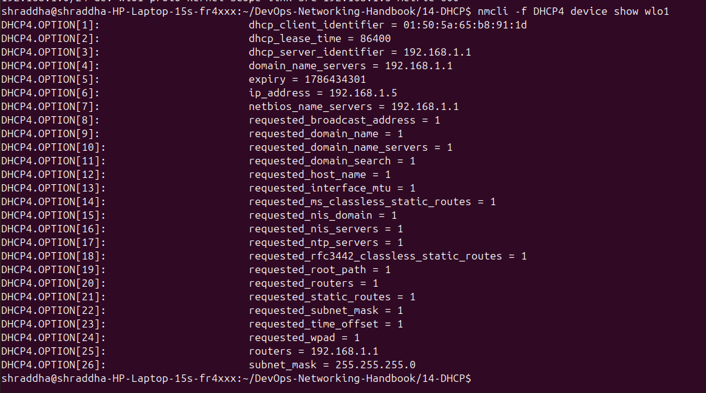
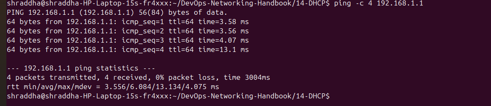
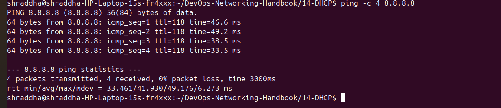
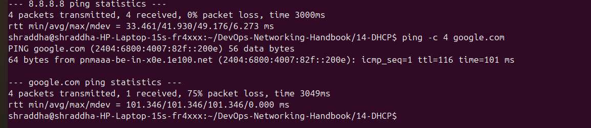
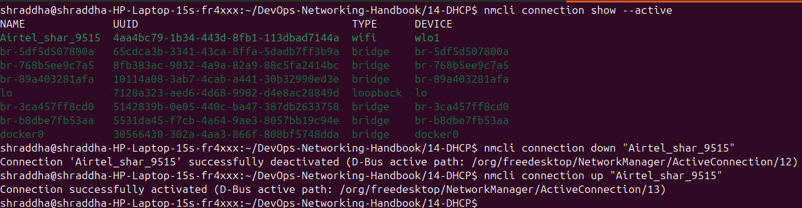
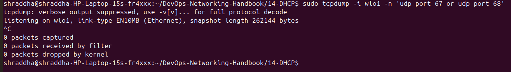

# 🌐 Chapter 14 – DHCP

## Dynamic Host Configuration Protocol

DHCP (Dynamic Host Configuration Protocol) automatically provides network configuration to clients.

Instead of manually configuring every device with an IP address, subnet mask, gateway, and DNS server, DHCP allows a network to provide this information automatically.

---

## 📑 Table of Contents

* [What is DHCP?](#-what-is-dhcp)
* [Why DHCP is Important](#-why-dhcp-is-important)
* [How DHCP Works](#-how-dhcp-works)
* [DORA Process](#-dora-process)
* [DHCP Ports](#-dhcp-ports)
* [DHCP Information](#-information-provided-by-dhcp)
* [DHCP Lease](#-dhcp-lease)
* [DHCP Pool](#-dhcp-pool)
* [DHCP Reservation](#-dhcp-reservation)
* [DHCP Relay](#-dhcp-relay)
* [Linux Practical Lab](#-linux-practical-lab)
* [Commands](#-important-linux-commands)
* [Real-World Use Cases](#-real-world-use-cases)
* [Troubleshooting](#-troubleshooting)
* [Interview Questions](#-interview-questions)
* [Screenshots](#-screenshots)
* [Key Takeaways](#-key-takeaways)

---

# 🔹 What is DHCP?

DHCP stands for:

```text
Dynamic Host Configuration Protocol
```

It automatically provides network configuration to clients.

A DHCP server can provide:

```text
IP Address
Subnet Mask
Default Gateway
DNS Server
Lease Information
Other DHCP Options
```

### Without DHCP

```text
Administrator
     ↓
Manually configure
     ↓
IP
Subnet
Gateway
DNS
```

### With DHCP

```text
Client
   ↓
DHCP
   ↓
Automatic Configuration
```

This makes network administration easier, especially when there are many devices.

---

# 🔹 Why DHCP is Important

Imagine an organization with 500 computers.

Manually configuring:

```text
500 IP addresses
500 subnet masks
500 gateways
500 DNS configurations
```

would be time-consuming and error-prone.

DHCP provides centralized and automatic configuration:

```text
                 DHCP Server
                      |
        +-------------+-------------+
        |             |             |
      Client        Client        Client
        |             |             |
      IP            IP            IP
```

---

# 🔹 How DHCP Works

A DHCP client initially needs network configuration.

It communicates with a DHCP server to obtain the required information.

The classic process is:

```text
Client                         DHCP Server
  |                                 |
  |-------- Discover -------------->|
  |                                 |
  |<--------- Offer ----------------|
  |                                 |
  |-------- Request --------------->|
  |                                 |
  |<---------- ACK -----------------|
  |                                 |
```

This process is commonly remembered as **DORA**.

---

# 🔹 DORA Process

## 1. Discover

The client searches for available DHCP servers.

```text
Client
   |
   | DHCP Discover
   ↓
Network
```

---

## 2. Offer

A DHCP server responds with an available network configuration.

```text
DHCP Server
     |
     | DHCP Offer
     ↓
Client
```

The offer can contain information such as:

```text
IP Address
Subnet Mask
Gateway
DNS
Lease Time
```

---

## 3. Request

The client requests the offered configuration.

```text
Client
   |
   | DHCP Request
   ↓
DHCP Server
```

---

## 4. Acknowledgement

The DHCP server confirms the configuration.

```text
DHCP Server
     |
     | DHCP ACK
     ↓
Client
```

The client can now configure its network interface.

---

# 🔹 DHCP Ports

DHCP uses UDP.

```text
UDP 67 → DHCP Server
UDP 68 → DHCP Client
```

Remember:

```text
67 → Server
68 → Client
```

---

# 🔹 Information Provided by DHCP

DHCP can provide:

| Information       | Example                 |
| ----------------- | ----------------------- |
| IP Address        | `192.168.1.5`           |
| Subnet Prefix     | `/24`                   |
| Gateway           | `192.168.1.1`           |
| DNS Server        | `192.168.1.1`           |
| Lease Information | Time-limited allocation |

For example:

```text
IP:
192.168.1.5/24

Gateway:
192.168.1.1

DNS:
192.168.1.1
```

---

# 🔹 DHCP Lease

A DHCP address is normally associated with a lease.

A lease defines how long the client can use the assigned configuration.

Conceptually:

```text
DHCP Server
     |
     | IP + Lease
     ↓
Client
     |
     | Renew
     ↓
DHCP Server
```

The client can renew the lease according to the DHCP process.

---

# 🔹 DHCP Pool

A DHCP pool is a range of addresses available for dynamic assignment.

Example:

```text
192.168.1.100 - 192.168.1.200
```

Clients can receive addresses from this range.

If the available addresses are exhausted:

```text
New Client
    ↓
DHCP Request
    ↓
No Available Address
    ↓
Configuration Failure
```

---

# 🔹 DHCP Reservation

A DHCP reservation allows a particular client to consistently receive a specific address.

Conceptually:

```text
Client Identifier
       ↓
Reserved IP
       ↓
192.168.1.50
```

Common use cases include:

```text
Printers
NAS Devices
Cameras
Network Appliances
Development Devices
```

---

# 🔹 DHCP Relay

DHCP broadcasts normally do not cross routers.

A DHCP relay allows clients on one network to communicate with a DHCP server located on another network.

```text
Client
   |
   ↓
VLAN
   |
   ↓
Layer 3 Device
   |
   ↓
DHCP Relay
   |
   ↓
DHCP Server
```

This allows organizations to centralize DHCP services.

---

# 🧪 Linux Practical Lab

This chapter was tested on Ubuntu Linux using NetworkManager.

The active Wi-Fi interface was:

```text
wlo1
```

The active connection was:

```text
Airtel_shar_9515
```

The observed IPv4 configuration included:

```text
IP Address:
192.168.1.5/24

Gateway:
192.168.1.1

DNS:
192.168.1.1
```

The connection was successfully disconnected and reconnected using NetworkManager.

```bash
nmcli connection down "Airtel_shar_9515"
```

```bash
nmcli connection up "Airtel_shar_9515"
```

This demonstrated the practical network reconnection workflow.

> The observed configuration proves the active IPv4 settings. The exact DHCP source of each value should be confirmed from DHCP lease/options or network configuration rather than assumed from `ip` output alone.

---

# 🔧 Important Linux Commands

### Show interfaces

```bash
ip link show
```

### Show IP addresses

```bash
ip addr show
```

### Show routing table

```bash
ip route
```

### Show NetworkManager devices

```bash
nmcli device status
```

### Show active connections

```bash
nmcli connection show --active
```

### Show interface information

```bash
nmcli device show wlo1
```

### Inspect DHCP information

```bash
nmcli -f DHCP4 device show wlo1
```

### Check NetworkManager

```bash
systemctl status NetworkManager
```

### Check NetworkManager logs

```bash
journalctl -u NetworkManager
```

### Search DHCP logs

```bash
journalctl -u NetworkManager | grep -i dhcp
```

### Capture DHCP packets

```bash
sudo tcpdump -i wlo1 -n 'udp port 67 or udp port 68'
```

### Test gateway

```bash
ping -c 4 192.168.1.1
```

### Test Internet by IP

```bash
ping -c 4 8.8.8.8
```

### Test DNS and Internet

```bash
ping -c 4 google.com
```

---

# 🌍 Real-World Use Cases

DHCP is commonly used in:

```text
Home Networks
Office Networks
Enterprise Networks
Wi-Fi Networks
VLANs
Development Environments
Virtual Machines
Infrastructure Networks
CI/CD Runner Infrastructure
```

A typical enterprise design can look like:

```text
              DHCP Infrastructure
                     |
        +------------+------------+
        |            |            |
      VLAN 10      VLAN 20      VLAN 30
        |            |            |
      Users       Developers     Servers
```

---

# 🛠️ Troubleshooting

When a machine cannot connect to the network, troubleshoot systematically.

```text
Interface
    ↓
Link
    ↓
IP Address
    ↓
DHCP
    ↓
Default Gateway
    ↓
DNS
    ↓
Internet
```

### 1. Check interface

```bash
ip link show
```

### 2. Check IP

```bash
ip addr show
```

### 3. Check route

```bash
ip route
```

### 4. Check NetworkManager

```bash
nmcli device status
```

### 5. Check DHCP

```bash
nmcli -f DHCP4 device show wlo1
```

### 6. Check logs

```bash
journalctl -u NetworkManager | grep -i dhcp
```

### 7. Capture packets

```bash
sudo tcpdump -i wlo1 -n 'udp port 67 or udp port 68'
```

### 8. Test gateway

```bash
ping -c 4 192.168.1.1
```

### 9. Test Internet

```bash
ping -c 4 8.8.8.8
```

### 10. Test DNS

```bash
ping -c 4 google.com
```

---

# 🎯 Interview Questions

The chapter covers interview questions such as:

1. What is DHCP?
2. Why is DHCP used?
3. What is DORA?
4. What is DHCP Discover?
5. What is DHCP Offer?
6. What is DHCP Request?
7. What is DHCP ACK?
8. Which protocol and ports does DHCP use?
9. What is a DHCP lease?
10. What is a DHCP pool?
11. What is a DHCP reservation?
12. What is DHCP relay?
13. Why is DHCP relay required?
14. How do you troubleshoot a machine with no IP address?
15. How do you troubleshoot DHCP using `tcpdump`?
16. What happens when a DHCP server is unavailable?
17. What happens when a DHCP pool is exhausted?

See:

```text
interview-questions.md
```

for detailed answers.

---

# 📸 Screenshots

The practical screenshots are stored in:

```text
screenshots/
```

They document the Chapter 14 DHCP lab.

### Screenshot 01 – IP Address


### Screenshot 02 – Routing Table



### Screenshot 03 – DHCP Information



### Screenshot 04 – Gateway Connectivity



### Screenshot 05 – Internet Connectivity



### Screenshot 06 – DNS Connectivity



### Screenshot 07 – DHCP Renewal



---

# 📚 Chapter Files

```text
14-DHCP/
├── README.md
├── commands.md
├── interview-questions.md
├── notes.md
├── practical-lab.md
├── real-world-usecases.md
├── screenshots/
│   ├── 01-ip-address.png
│   ├── 02-ip-route.png
│   ├── 03-dhcp-info.png
│   ├── 04-ping-gateway.png
│   ├── 05-ping-internet.png
│   ├── 06-ping-dns.png
│   └── 07-dhcp-renewal.png
└── troubleshooting.md
```

---

# 🧠 Key Takeaways

Remember these points for interviews and practical work:

```text
DHCP
 ↓
Dynamic Host Configuration Protocol
```

```text
DORA
 ↓
Discover
Offer
Request
ACK
```

```text
UDP 67
 ↓
DHCP Server
```

```text
UDP 68
 ↓
DHCP Client
```

```text
DHCP
 ↓
IP
Subnet
Gateway
DNS
Lease
```

```text
DHCP Relay
 ↓
Connects DHCP clients
to DHCP servers across routed networks
```

---

# 💼 DevOps Perspective

A DevOps engineer should not only know what DHCP means.

They should be able to troubleshoot it.

A practical troubleshooting mindset is:

```text
Observe
   ↓
Check Interface
   ↓
Check IP
   ↓
Check Route
   ↓
Check DHCP
   ↓
Check DNS
   ↓
Capture Packets
   ↓
Find Root Cause
   ↓
Fix
   ↓
Verify
   ↓
Document
```

> **Learn → Practice → Break → Debug → Document → Explain**

---

# 🏁 Chapter 14 Complete

DHCP concepts, Linux commands, practical testing, real-world use cases, troubleshooting, and interview preparation are documented in this chapter.
